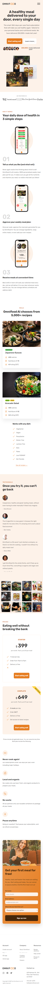

# <a href="https://Omnifood-lei.netlify.app" target="_blank">Omnifood</a>

Single page website built as a final project of HTML/CSS/JavaScript course. Omnifood is a
fictional company focused on providing AI-powered food subscription that will make you eat healthy again, 365 days per year. It's tailored to your personal tastes and nutritional needs.
  

## Key Features

Building the website from scratch. Here are some of the key features:

- Navigation drop-down available on tablet-sized and mobile devices

- Smooth scrolling animation applied to all links
- Sticky bar with subtle animation applied by using `IntersectionObserver`
- Cross-broswer support for certain CSS styles using prefixes (`-webkit`, `-moz-`)
- Fully responsive to ALL devices thanks to media queries
- Utilized `grid`, `flexbox` and `absolute positioning`

## Demonstration

### Desktop:

  

### Mobile phone:

  
